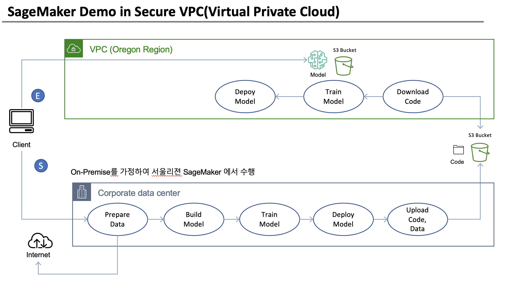

# Secure VPC에서 SageMaker 워크샵

---
# 전체 컨셉 구성도 (아래 워크샵 시나리오와 같이 보세요)

# 워크샵 시나리오
- 두개의 리젼에서 ML 워크로드가 실행이 됩니다.
    - 서울 리젼: No VPC 환경으로 On-premise환경을 가정하였습니다.
        - 데이타를 준비, 모델 빌딩, 모델 훈련 및 모델 배포 및 추론을 합니다.
        - 이후에 문제가 없다면, S3에 사용한 데이터 및 코드를 업로드 합니다.
    - 오리건 리젼: Secure VPC (인터넷 안됨) 환경으로 아래와 같은 작업을 합니다.
        - **[가정] 오리건 리젼에 Secure VPC가 이미 설치되었다고 가정 합니다.**
        - S3 에서 코드를 다운로드 합니다.
        - 모델 훈련을 합니다. 입력데이터의 위치는 S3 입니다.
            - 모델 훈련의 결과인 모델 아티펙트는 S3에 저장이 되어서, 이를 S3에 다운로드해서 On-premise에서 사용합니다.
        - 모델을 배포하고 추론합니다.
            - 데이터를 S3에서 다운로드를 하여 사용합니다.
            
---
## 노트북(코드) 구성
아래왁 같이 순서대로 실행 하시면 됩니다.
#### NoVPC Side (예: 서울 리젼)
- 1.1.NoVPC-Prepare-Data.ipynb
    - [옵션] 2.0.NoVPC-Build-Model.ipynb
- 2.1.NoVPC-Train-Model.ipynb
- 3.1.ALL-Deploy_Model.ipynb
- 4.1.NoVPC-Upload-Data-Code.ipynb

#### VPC Side(에: 오리건 리젼)
- 9.0.VPC-Download-Code.ipynb
- 2.1.VPC-Train-Model.ipynb
- 3.1.ALL-Deploy_Model.ipynb

